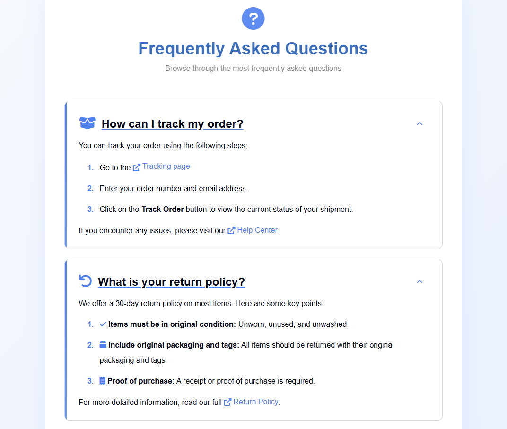

<h1 align="center">Advanced-FAQ-Page</h1>

  An enhanced version of the solution for the challenge titled 
  <a href="https://devchallenges.io/challenge/simple-faq-challenge" target="_blank">
    Simple Frequently Asked Questions (FAQ)
  </a>
  from 
  <a href="https://devchallenges.io" target="_blank">devChallenges.io</a>

  

    <small>by</small> 
    <i>
      <a href="https://www.linkedin.com/in/adam-ross-destafeno" style="color: white;" target="_blank">
        Adam Ross DeStafeno
      </a>
    </i>
  

  <h3>
    <a href="https://ryuukae.io/advanced-faq-page/src/index.html">Demo</a>
     | 
    <a href="https://www.github.com/Ryuukae/advanced-faq-page">Solution</a>
     | 
    <a href="https://devchallenges.io/challenge/simple-faq-challenge">Challenge</a>
  </h3>

- - -

- - -
<!-- TABLE OF CONTENTS -->

## Table of Contents

- [Overview](#overview)
    - [What I learned](#what-i-learned)
    - [Useful resources](#useful-resources)
- [Features](#features)
    - [Project Structure](#project-structure)
    - [Built with](#built-with)
- [Author Credits](#author-credits)
- [Contact](#contact)
- [Acknowledgements](#acknowledgements)
                 
<!-- OVERVIEW -->

## Overview
- - -
   A basic FAQ page for a generic business, this repository builds on the previously submitted solution for the "Simple FAQ Challenge" presented by DevChallenges. 
The project is designed to showcase a responsive FAQ component that can be easily integrated into various web applications.

   The solution uses modern HTML5, CSS3, and JavaScript (ES6+) technologies to create a lightweight yet visually pleasing FAQ component. It follows best practices for 
front-end 
development, including semantic HTML structure, modular CSS organization, and a reusable JavaScript function.

This project demonstrates proficiency in:

- Responsive web design principles
- CSS animations and transitions
- DOM manipulation techniques
- Event-driven programming

   The project that can be used to enhance the UI. is designed to be easily customizable and can be further extended with additional features such as localization support or 
integration with backend APIs.

### What I learned

- How to utilize the CSS media feature 'pointer' to ascertain the category of the user's device by identifying the primary pointing device, (such as a mouse), and if so, how
  accurate the primary pointing device is.

- Implementing modular CSS architecture for better maintainability and scalability.

- Writing semantic and accessible HTML, ensuring better compatibility with screen readers and assistive technologies.

- Leveraging JavaScript event delegation to manage dynamic elements efficiently.

- Utilizing CSS transitions to enhance user interactions with smooth animations.

- Incorporating third-party libraries, such as Font Awesome, to improve the visual appeal of the project while maintaining simplicity.

- Applying responsive web design principles to create layouts that adapt seamlessly across various screen sizes and devices.

### Useful resources

- [Responsive Web Design Tips & Tricks](https://webflow.com/blog/responsive-web-design-tricks-and-tips) - Helpful tips regarding responsive web design.
- [Pointer Media Feature MDN Reference](https://developer.mozilla.org/en-US/docs/Web/CSS/@media/pointer) - Article exploring the different pointer types.
- [MDN Core Learning Module: CSS Layers](https://developer.mozilla.org/en-US/docs/Learn_web_development/Core/CSS_layout) - A collection of useful articles on the 
  fundamentals of css layouts and responsive web-design.
- [Font Awesome](https://fontawesome.com) - Font Awesome is a popular icon library that provides developers with access to hundreds of scalable vector icons.

## Features
- - -

- <i>A clean and minimalist design
- Icons sourced from font-awesome
- Smooth animations for improved user experience
- Accessibility considerations for better inclusivity
- Responsive layout that adapts to different screen sizes
- Toggle buttons for the question hiding and showing feature</i>
         
- - -

### Project Structure
- - - _       
/       
src/

       ├── index.html   
      └── styles/  
        ├── base-styles.css        
        ├── color-pallet.css    
        ├── font-styles.css      
        └── responsive-styles.css          
└── scripts/                   
         └── script.js           

 - ─── ── README.md
     - - - - - |

### Built with
  - - - _

- <b>Markup Languages</b>
- - <i> HTML5</i>
- - <i>CSS3</i>
-

- <b>Programming Languages</b>
- - <i>JavaScript (ES6+)</i>
-

- <b>Icon Library</b>
- - <i>Font Awesome</i>
-  -   
-

## Author Credits

This <i><b>[repository](https://www.github.com/Ryuukae/advanced-faq-page)</i></b> is...
- -[x] <i><b><u>Owned 
- - - [x] Written
- - - - [x] Maintained</u></b></i> 

- -
by <i><u><a href="https://www.linkedin.com/in/adam-ross-destafeno" style="color: white;">Adam Ross DeStafeno</a></u></i>
            
         

## Contact

For any additional information or queries, you can reach out through:

[//]: # (- **Personal Website:** [your-website.com]&#40;https://{your-web-site-link}&#41;)

- **GitHub:**
  - <i><a href="https://github.com/Ryuukae" target="_blank">[@ryuukae](https://github.com/Ryuukae)</a></i>
- **LinkedIn:** 
   - <i><a href="https://www.linkedin.com/in/adam-ross-destafeno" target="_blank">[Adam Ross DeStafeno](https://www.linkedin.com/in/adam-ross-destafeno)</a></i>

- **Email:** 
  - <i><a class="copy-link" href="mailto:contact@adamrossdestafeno.dev" onclick="navigator.clipboard.writeText('contact@adamrossdestafeno.dev'); return false;">
  contact@adamrossdestafeno.dev</a></i>
  - <i><a href="mailto:contact@adamrossdestafeno.dev" onclick="navigator.clipboard.writeText('contact@adamrossdestafeno.dev'); return false;">
    ryuukae.dev@gmail.com</a></i>

## Acknowledgements

- <i>Many thanks to devChallenges.io for presenting thought-provoking and educational web development challenges.</i>
                            

- <i>Heartfelt appreciation to the devChallenges.io community for offering valuable feedback and insights.</i>
                                                                                              

- <i>Font Awesome for their amazing service and extensive icon library.</i>

